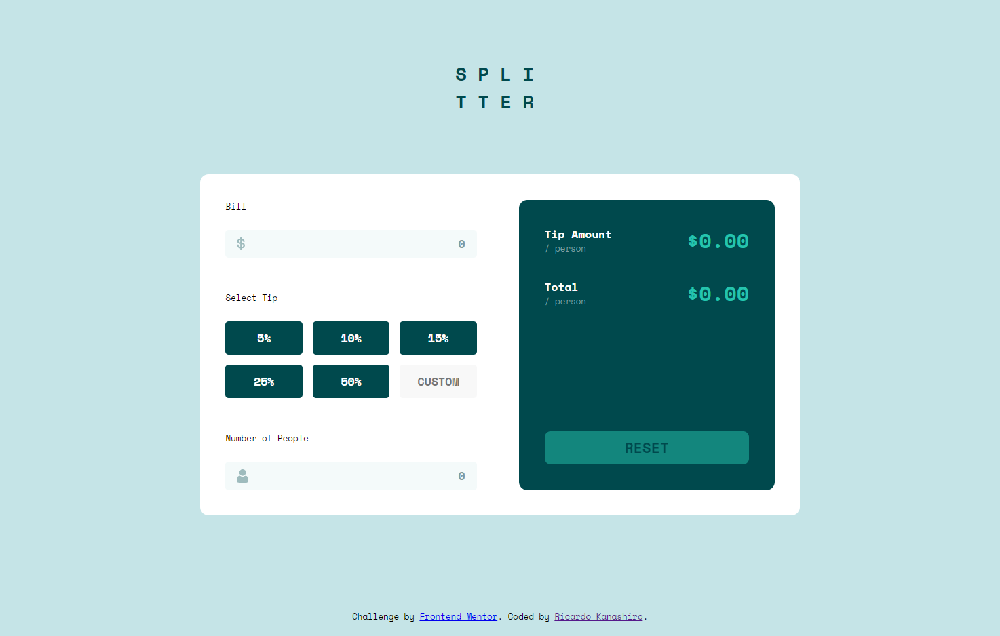

# Desafio Front-end - Tip Calculator

## Sumário:

- [Visão Geral](#visão-geral)
  - [Sobre o Desafio](#sobre-o-desafio)
  - [Links](#links)
- [Sobre o Processo](#sobre-o-processo)
  - [Tecnologias Utilizadas](#tecnologias-utilizadas)
  - [O que eu aprendi](#o-que-eu-aprendi)
  - [O que preciso focar mais](#o-que-preciso-focar-mais)

## Visão Geral



### Sobre o Desafio

O desafio se baseia em uma calculadora para taxas. O usuário coloca o valor da conta, a porcentagem da taxa e o número de pessoas que vão pagar a conta, e retorna o valor da taxa e o quanto cada pessoa irá pagar de acordo com valor cheio (valor da conta + valor da taxa).

Os usuários devem ser capazes de:

- Veja o layout ideal do aplicativo dependendo do tamanho da tela do dispositivo;
- Veja os estados de foco para todos os elementos interativos na página;
- Calcule a gorjeta correta e o custo total da conta por pessoa;
- Não conseguir calcular caso o valor da conta ou o número de pessoas seja 0;

### Links

<div class="container">
  - Solução no site: <a href=""></a>
</div>

<div class="container">
  - Live Preview do desafio: <a href="https://github.com/ricardokanashiro/Tip-Calculato"></a>
</div>


## Sobre o Processo

Confira nessa sessão quais foram as tecnologias e conceitos mais utilizados nesse desafio:

### Tecnologias utilizadas

<div class="container2">
  •  : linguagem de marcação de hypertexto utilizada para construir o conteúdo da página.
</div>

<div class="container2">
  •  : linguagem de estilização utilizado para estilizar os componentes da página
</div>

<div class="container2">
  •  : pré-procesador css utilizado para facilitar a padronização e estilização de componentes
</div>

<div class="container2">
  •  : linguagem de programação de scripts, utilizado para trazer dinamismo e funções da página
</div>

### O que eu aprendi?

  Como esse desafio foi utilizado para praticar e fixar melhor meus conhecimentos em desenvolvimento front-end, durante esse desafio eu aprendi a lidar melhor com a responsividade de componentes, utilizando os media queries apenas quando realmente necessário. Para efetuar isso utilizei medidas relativas, como: %, em, rem, vw, vh; e a função clamp() e calc() do css. 

  Para fontes utilizei mais: a unidade rem, para tamanhos mais fixos porém para acessibilidade; calc(), para fazer fontes adaptativas com de acordo com a largura da tela, ou seja, utilizando a unidade vw para isso enquanto é somado com um valor na unidade rem, para controlar a variação:

```css
.main-text-example1 {
  font-size: 5rem;
  /* A unidade rem é mais "fixa" mas se adapta também de acordo com o dispositivo */
}

.main-text-example2 {
  font-size: calc(3rem + 2vw);
  /* A função calc() é usada para fazer o tamanho variar de acordo com a largura da tela, através da unidade vw, e somado ao 3rem para controlar a variação */
}

.main-text-example3 {
  font-size: clamp(2.5rem, 3rem + 2vw, 5rem);
  /* A função clamp vai seguir a mesma lógica da função calc, porém, irá delimitar um máximo e minimo que essa variação pode chegar */
}
```

### O que preciso focar mais?

  Como o intuito desse desafio foi, além de praticar meus conhecimentos em html, css e javascript, foi treinar mais a reponsividade independentemente de media queries, irei continuar estudando e praticando isso, aprimorando certos aspectos, como padronizar medidas para tamanho de fonte e de componentes.